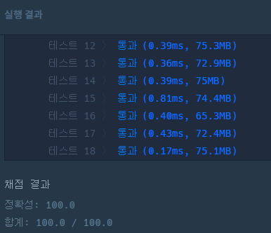

문제 링크 : [https://school.programmers.co.kr/learn/courses/30/lessons/12951]

## 문제에 대한 내용

### 문제

JadenCase란 모든 단어의 첫 문자가 대문자이고, 그 외의 알파벳은 소문자인 문자열입니다. 단, 첫 문자가 알파벳이 아닐 때에는 이어지는 알파벳은 소문자로 쓰면 됩니다. (첫 번째 입출력 예 참고)  
문자열 s가 주어졌을 때, s를 JadenCase로 바꾼 문자열을 리턴하는 함수, solution을 완성해주세요.

### 제한 조건

- s는 길이 1 이상 200 이하인 문자열입니다.
- s는 알파벳과 숫자, 공백문자(" ")로 이루어져 있습니다.
  - 숫자는 단어의 첫 문자로만 나옵니다.
  - 숫자로만 이루어진 단어는 없습니다.
  - 공백문자가 연속해서 나올 수 있습니다.

### 입출력 예

| s                       | return                  |
| ----------------------- | ----------------------- |
| "3people unFollowed me" | "3people Unfollowed Me" |
| "for the last week"     | "For The Last Week"     |

## 접근 방식

### 잘못된 접근

1. 문자열로 입력받은 S에 대해 split으로 나눠 문자열 배열로 변경한다.
2. 변경한 문자열을 for문으로 돌면서, 문자열의 첫 문자가 숫자인 경우를 구분한다.
   1. 만약 숫자인 경우, 그대로 두고 for문을 넘긴다.
   2. 만약 숫자가 아닌 경우, 대문자로 변경한다.
3. 하나의 문자열을 다 돌면, 공백을 추가해서 문자를 구분할 수 있도록 한다.
4. 최종 결과를 return 한다.

### 잘못 된 접근2

위의 접근에는 문제가 있었다.  
바로 `공백이 이어서 등장할 수 있다는 조건`을 잊은 것!

따라서 공백이 이어서 등장하는 경우, 만약 for문을 돌다가 현재 문자열이 공백인 경우는 공백을 추가하고, continue로 넘긴다.

### 잘 된 접근

위에서도 문제가 있었다.  
공백이 마지막에 오는 경우에는, 공백을 기준으로 split이 되기 때문에 해당 공백을 무시한 채로 로직이 진행된다.  
따라서 마지막 return 전에

```java
if (S.length() != answer.toString().length()) answer.append(" ");
```

입력 받은 문자열의 길이와 return하려는 문자열의 길이가 다른 경우 공백을 추가해주는 것으로 마무리 했다.

## 결과

### 소스 코드

```java
import java.util.*;
class Solution {
    public String solution(String S) {
        StringBuilder answer = new StringBuilder();
        StringBuilder sb = new StringBuilder();
        String s[] = S.split(" ");
        int cnt;
        for (String i:s){
            sb.setLength(0);
            cnt = 0;
            if (i.equals("")){
                answer.append(" ");
            }
            for (char c:i.toCharArray()){
                cnt++;
                if(Character.isDigit(c)) {
                    sb.append(c);
                }
                else {
                    if (cnt == 1) sb.append(Character.toUpperCase(c));
                    else {
                        sb.append(Character.toLowerCase(c));
                    }
                }

            }
            if (sb.length() > 0){
                if (answer.length() > 0) answer.append(" ");
                answer.append(sb);
            }
        }
        if (S.length() != answer.toString().length()) answer.append(" ");
        return answer.toString();
    }
}
```

### 결과 이미지



결과는 위와 같이 통과 되었다.

## 다른 접근 방식

어떻게든 풀기는 했지만, 현재의 접근 방식은 다소 효율적이지 못한 것 같다는 느낌을 받았다.  
문자열을 추가하는 다루는 과정을 효율적으로 처리할 수 있는 다른 방법을 알아보기 위해, 다른 사람들의 소스 코드를 찾아봤다.

[https://school.programmers.co.kr/learn/courses/30/lessons/12951]: https://school.programmers.co.kr/learn/courses/30/lessons/12951
